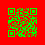

# QR Code Generator Server

A simple API server for generating QR codes.

## 💪 Features

- ✅ Asynchronous QR code generation
- ✅ Fast and lightweight
- ✅ Different formats (PNG, SVG, etc.)
- ✅ Customizable QR code size, color, etc

## 🚀 Getting Started

### Prerequisites

- [Bun](https://bun.sh)

### Step 1

Clone the repository

```sh {"id":"01J6K7HS08C87M42HE07X7GXAY"}
git clone https://github.com/tobycm/qr-code-generator-server
cd qr-code-generator-server
```

### Step 2

Install the dependencies

```sh {"id":"01J6K7JKVY7RS3486R0TW8XXAG"}
bun i
```

### Step 3

Start the server

```sh {"id":"01J6K7P605DHZ0FABRMZHVTPZ3"}
bun run start
```

## API Docs 😭

### `GET /`

Returns a message:

```json
{
  "message": "Hello World"
}
```

### `POST /qr`

Generates a QR code.

### Request body

Any text data

Examples:
```
https://tobycm.dev
```

### Request query parameters

- `format`

    The format of the QR code. Default is `png`.
    
    Supported formats:
    - `png`
    - `svg`
    - `utf8` (try it out xd)

- `margin`

    The margin of the QR code. Default is `4`.

- `errorCorrection`

    The error correction level of the QR code. Default is `M`.

    Supported error correction levels:
    - `L`
    - `M`
    - `Q`
    - `H`

- `scale`

    The pixel per block of the QR code. Default is `4`.

- `width`

    The width of the QR code. Overrides `scale`.

- `background`

    The background color of the QR code in RGBA. Default is `#ffffffff`.

- `foreground`

    The foreground color of the QR code in RGBA. Default is `#000000ff`.

### Response

Headers:
- `Content-Type`

    The content type of the QR code. Based on the `format` query parameter.

Body:

The QR code image or text data.


### Example

Request:
```
POST /qr?format=svg&margin=8&errorCorrection=H&scale=8&background=%23ff0000ff&foreground=%2300ff00ff
```

Body:
```
https://tobycm.dev
```

Response:



## 📚 Tech Stack

- [Bun](https://bun.sh)
- [node-qrcode](https://www.npmjs.com/package/qrcode)
- [TypeScript](https://www.typescriptlang.org)

## 📝 License

This project is licensed under the MIT License - see the [`LICENSE`](LICENSE) file for details.

## 🤝 Contributions

Any contribution is appreciated. Just create an issue/pull request and I will review it ASAP.

## 🔗 Share this project

If you like this project, please give it a ⭐ and share it with your friends!
